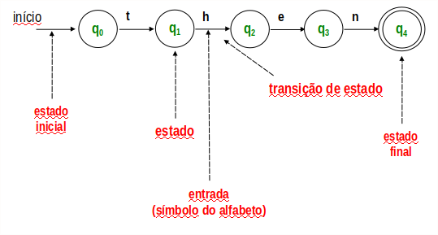

# Automatos finitos ( AF )

Tipo simples de reconhecedor de linguagens, vist como uma máquina de estados
( modelo matemático com número finito e pré-definidos de estados )

## Condições de parada.
    1. Todos os símbolos foram processados e o estado corrente é final, logo a entrada percente ao alfabeto.
    2. Se o último estado alcançado não for final, a entrada é rejeitada.
    3. Se não existe transição para a entrada

## Definição

Um automato finito é uma tupla com 5 elementos `M = (Σ, Q, δ, q0, F)`, onde:

    `Σ` é o alfabeto de símbolos de entrada.
    `Q` é um conjunto finito não-vazio de estados.
    `δ` é a função de transição que descreve matematicamente a operação do automato,
determinado o novo estado qi; Em função do estado corrente qk e do símbolo de entrada S, simbolicamente, δ(qk, S) = qi;
    `q0` é o estado inicial.
    `F` é o conjunto de estados finais (F ⊆ Q) 

Exemplo de automato com: ab+ | (ab)+

Palavras de teste: abb; abab; abaab;

         a       b       b
abb: q0 ---> q1 ---> q2 ---> q2. É final `OK`

         a       b       a
abab: q0 ---> q1 ---> q2 ---> ?
         ---> q3 ---> q4 ---> q3 ---> q4. É final `OK`
                                  b

         a       b       a
abab: q0 ---> q1 ---> q2 ---> ?
         ---> q3 ---> q4 ---> q3 ---> ?. Falhou
                                  a

> Nota: Automatos finitos não deterministicos para a tabela do arquivo `01_regexp` podem ser encontradas [aqui](./assets/automatas.png)
