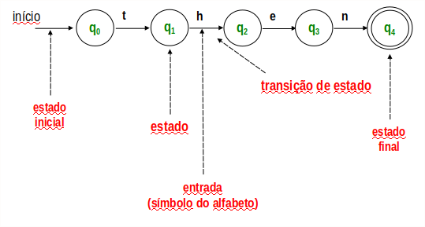

# Autômatos finitos ( AF )

Tipo simples de reconhecedor de linguagens, vist como uma máquina de estados
( modelo matemático com número finito e pré-definidos de estados )

## Condições de parada.
    1. Todos os símbolos foram processados e o estado corrente é final, logo a entrada percente ao alfabeto.
    2. Se o último estado alcançado não for final, a entrada é rejeitada.
    3. Se não existe transição para a entrada

## Definição

Um autômato finito é uma tupla com 5 elementos `M = (Σ, Q, δ, q0, F)`, onde:

    `Σ` é o alfabeto de símbolos de entrada.
    `Q` é um conjunto finito não-vazio de estados.
    `δ` é a função de transição que descreve matematicamente a operação do autômato,
determinado o novo estado qi; Em função do estado corrente qk e do símbolo de entrada S, simbolicamente, δ(qk, S) = qi;
    `q0` é o estado inicial.
    `F` é o conjunto de estados finais (F ⊆ Q) 

Exemplo de autômato com: ab+ | (ab)+

Palavras de teste: abb; abab; abaab;

         a       b       b
abb: q0 ---> q1 ---> q2 ---> q2. É final `OK`

         a       b       a
abab: q0 ---> q1 ---> q2 ---> ?
         ---> q3 ---> q4 ---> q3 ---> q4. É final `OK`
                                  b

         a       b       a
abab: q0 ---> q1 ---> q2 ---> ?
         ---> q3 ---> q4 ---> q3 ---> ?. Falhou
                                  a

> Nota: Autômatos finitos não deterministicos para a tabela do arquivo `01_regexp` podem ser encontradas
[aqui](./assets/automata_table_1.png) e [aqui](./assets/automata_table_2.png)

----
### Definindo um AF

#### Diagrama de transição

É utilizado em especificação
#### Tabela de transição

`->` - Estado inicial

`*` - Estado final

|     |   0  | 1  |
|:----|------|:--:|
|-> q0| q0q1 | q1 |
|* q1 | q2   | q1 |
| q2  | q1   | -  |

É utilizado em transformação AFN em AFD; Implementação

------
#### Definição formal

`Σ` = {0, 1}

`Q` = {q0, q1, q2}

`q0` = q0

`F` = {q1}

`δ` =

(q0, 0) = q0; (q0, 0) = q1; (q0, 1) = q1

(q1, 0) = q2; (q1, 1) = q1; (q2, 0) = q0

É utilizado em provas formais de propriedades

### Tipos de Autômatos finitos

AFD - Autômato finito determinístico

AFN - Autômato finito não determinístico

AFε - Autômato finito com movimento vazio. Ex:

### Algoritmo para transformar AFN em AFD

|      |   0  | 1  |
|:-----|------|:--:|
|-> q0 | q0q1 | q2 |
|* q1  | -    | q2 |
|* q2  | -    | q2  |

Aplicando o algortimo, adicionamos na lista os estados que foram criados com "junções" de outros.

|      |   0  | 1  |
|:-----|------|:--:|
|-> q0| q0q1 | q2 |
|* q0q1  | q0q1    | q2 |
|* q2  | -    | q2  |
